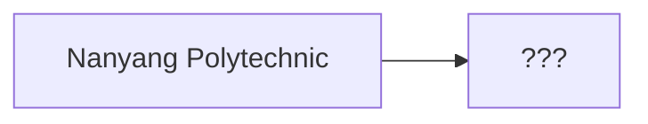

<h1 align="center">
  hi i'm a student
</h1>

<!---
hugh-jessel/hugh-jessel is a ✨ special ✨ repository because its `README.md` (this file) appears on your GitHub profile.
You can click the Preview link to take a look at your changes.
--->
